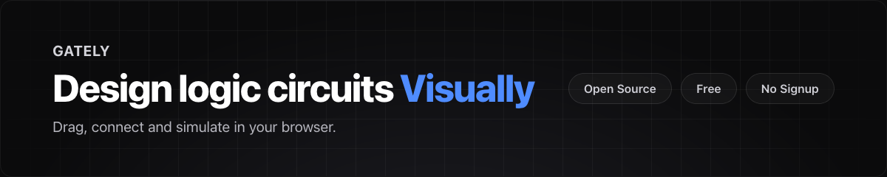
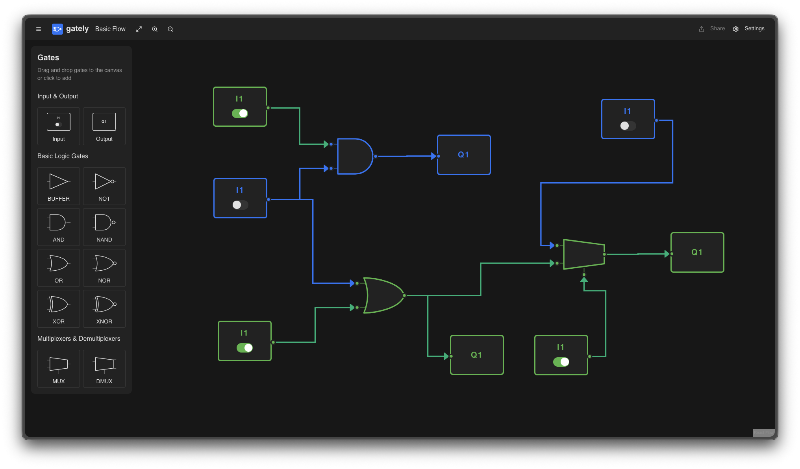

**[gately](https://gately.dev)** is a visual logic editor for building, simulating, and sharing digital circuits with
ease.  
Design logic circuits with drag-and-drop, get real-time simulation, and generate truth tables — no signup required.

## Features

- Drag-and-Drop Editor to build circuits visually
- Toolbox with AND, OR, NOT, XOR, NAND, NOR gates and more
- Live simulation with real-time feedback
- Automatic truth table generation
- Customizable grid, labels, and themes
- Modern, responsive interface
<!-- - Easy circuit sharing via link - coming soon -->

## How It Works

1. Add logic gates from the toolbox
2. Connect gates by dragging wires and customize labels



<!-- 3. Share or export your circuit easily -->

## FAQ

**What is Gately?**
A visual editor to create and simulate digital logic circuits.

**Is Gately free?**
Yes, free and open source with no login required.

**Do I need prior knowledge?**
No, suitable for beginners and experts alike.

**Can I share my circuits?**
Yes, easily share circuits via a link.

**Is it good for teaching?**
Yes, ideal for education and presentations.

## Project Structure

Gately is a monorepo built with Turborepo:

- **apps/web** - Web editor (app.gately.dev) - Vite SPA
- **apps/landing** - Marketing site (gately.dev) - Astro static site
- **apps/desktop** - Desktop app - Tauri native app
- **packages/ui** - Shared React components for the editor
- **packages/core** - Core logic simulation engine

See individual app READMEs for development instructions.

## Getting Started

### Prerequisites

- Node.js 18+
- bun

### Installation

```bash
git clone https://github.com/jakmaz/gately.git
cd gately
bun install
bun run dev
```

Open [http://localhost:3000](http://localhost:3000) in your browser.

## Contributing

1. Fork the repository
2. Create a feature branch (`git checkout -b feature/my-feature`)
3. Make your changes
4. Run `bun run lint` to check code quality
5. Commit your changes (`git commit -am 'Add new feature'`)
6. Push to the branch (`git push origin feature/my-feature`)
7. Open a Pull Request

## License

This project is licensed under the [MIT License](./LICENSE).
